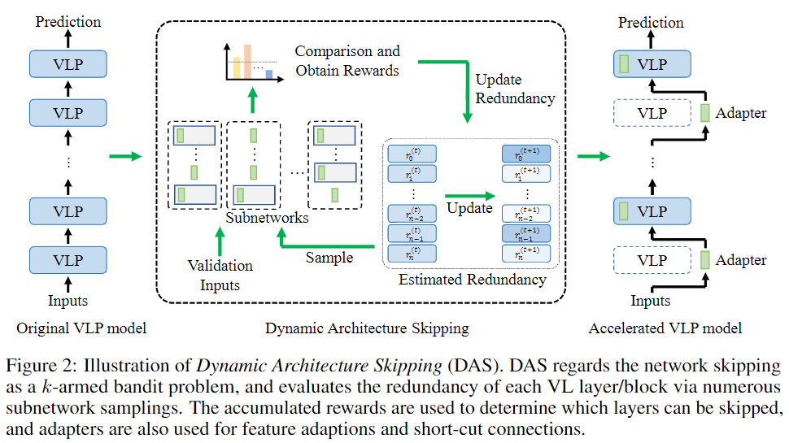

This repository contains the implementation of the NeurIPS 2023 paper:
> **Parameter and Computation Efficient Transfer Learning for Vision-Language Pre-trained Models** 
> [[Paper]](https://arxiv.org/abs/2309.01479) <br>
> [Qiong Wu](https://scholar.google.com/citations?hl=en&user=HyKLYKYAAAAJ)<sup>12</sup>,  Wei Yu<sup>12</sup>, Yiyi Zhou<sup>12</sup>, Shubin Huang<sup>1</sup>, [Xiaoshuai Sun](https://sites.google.com/view/xssun)<sup>12</sup>, [Rongrong Ji](https://mac.xmu.edu.cn/rrji/)<sup>12</sup>
><sup>1</sup>Media Analytics and Computing Lab, Department of Artificial Intelligence, School of Informatics, Xiamen University  
> <sup>2</sup>Institute of Artificial Intelligence, Xiamen University 

In this paper, we aim at parameter and computation efficient transfer learning (PCETL) for VLP models. In particular, PCETL not only needs to limit the number of trainable parameters in VLP models, but also to reduce the computational redundancy during inference, thus enabling a more efficient transfer. To approach this target, we propose a novel dynamic architecture skipping (DAS) approach towards effective PCETL. DAS first observes the significances of their modules to downstream tasks via a reinforcement learning (RL) based process, and then skips the redundant ones with lightweight networks, i.e., adapters, according to the obtained rewards.

---

<div  align="center">    

</div>

---

## Setup
### Install for ViLT and METER

```bash
pip install -r requirements.txt
pip install -e .
```

### Dataset Preparation for ViLT and METER

We follow [ViLT](https://github.com/dandelin/ViLT) and use `pyarrow` to serialize the datasets. See [this link](https://github.com/dandelin/ViLT/blob/master/DATA.md) for details.


### Install for LaVIN

```bash
cd LaVIN-DAS
conda create -n lavin python=3.8 -y
conda activate lavin

# install pytorch
conda install pytorch==1.12.1 torchvision==0.13.1 torchaudio==0.12.1 -c pytorch

# install dependency and lavin
pip install -r requirements.txt
pip install -e .
```

### Preparation for LaVIN

Obtain the weights of LLaMA from [this form](https://forms.gle/jk851eBVbX1m5TAv5)  (official) or Download [LLaMA-7B](https://huggingface.co/nyanko7/LLaMA-7B/tree/main)

For ScienceQA, please prepare the dataset from the [official repo](https://github.com/lupantech/ScienceQA).

For BoolQ, CommonSenseQA and gsm8k, please run:

```bash
pip install datasets
python OrgBoolQ.py
python OrgCommonSenseQA.py
python OrgGSM8K.py
```

The file structure should look like:


```bash
LaVIN-DAS/
  |-- das
  |-- scripts
  |-- train.py
  |-- eval.py
  ......
data/
  |-- problem.json
  |-- pid_splits.json
  |-- captions.json
  |-- all_data.json
  |-- images
      |-- train          # ScienceQA train image
      |-- val            # ScienceQA val image
      |-- test           # ScienceQA test image
  |-- weights
      |-- tokenizer.model
          |--7B
              |-- params.json
              |-- consolidated.00.pth
          ......
  |-- BoolQ
      |-- boolq_0_shot_test.json
  |-- GSM8K
      |-- gsm8k_0_shot_test.json
  |-- CommonSenseQA
      |-- commonsense_qa_0_shot_test.json
```

## Fine-tuning on Downstream Tasks

Work on the METER:

```bash
cd METER
```

Work on the ViLT:

```bash
cd ViLT
```

### VQAv2

#### Search

```bash
sh script/vqa_search.sh
```

#### Train

Add search result to vqa_train.sh by additional parameter 'skip_module'.  

```bash
sh script/vqa_train.sh
```

#### Evaluate

Add the path of checkpoint and 'skip_module' to vqa_eval.sh.

```bash
sh script/vqa_eval.sh
```

### Flickr30k IR/TR

#### Search

```bash
sh script/F30K_search.sh
```

#### Train

Add search result to F30K_train.sh by additional parameter 'skip_module'.  

```bash
sh script/F30K_train.sh
```

#### Evaluate

Add the path of checkpoint and 'skip_module' to F30K_eval.sh.

```bash
sh script/F30K_eval.sh
```

### NLVR2

#### Search

```bash
sh script/nlvr_search.sh
```

#### Train

Add search result to F30K_train.sh by additional parameter 'skip_module'.  

```bash
sh script/nlvr_train.sh
```

#### Evaluate

Add the path of checkpoint and 'skip_module' to nlvr_eval.sh.

```bash
sh script/nlvr_eval.sh
```

### ScienceQA

We also evaluate the experiment results on SceinceQA following [LaVIN](https://github.com/luogen1996/LaVIN/tree/main)

#### Experiments results

<p>Table 1: Comparison of DAS and PETL methods on ScienceQA for LLaMA.</p>
<table>
<thead>
<tr>
<th>Method</th>
<th>Update Params</th>
<th>Inference Time</th>
<th>Modality Natural</th>
<th>Modality Social</th>
<th>Modality Language</th>
<th>Context Text</th>
<th>Context Image</th>
<th>Context No</th>
<th>Grade G1-6</th>
<th>Grade G7-12</th>
<th>Avg</th>
</tr>
</thead>
<tbody>
<tr>
<td>LaVIN-7B</td>
<td>3.8M</td>
<td>3.70s</td>
<td>89.25</td>
<td>94.94</td>
<td>85.24</td>
<td>88.51</td>
<td>87.46</td>
<td>88.08</td>
<td>90.16</td>
<td>88.07</td>
<td>89.41</td>
</tr>
<tr>
<td>DAS2-7B</td>
<td>4.2M</td>
<td>3.44s</td>
<td>88.68</td>
<td>94.94</td>
<td>86.45</td>
<td>88.03</td>
<td>86.81</td>
<td>88.92</td>
<td>90.20</td>
<td>88.00</td>
<td>89.41</td>
</tr>
<tr>
<td>DAS4-7B</td>
<td>4.6M</td>
<td>3.23s</td>
<td>88.99</td>
<td>94.60</td>
<td>85.09</td>
<td>87.88</td>
<td>86.51</td>
<td>88.36</td>
<td>89.72</td>
<td>88.13</td>
<td>89.15</td>
</tr>
<tr>
<td>DAS6-7B</td>
<td>5.0M</td>
<td>3.06s</td>
<td>87.30</td>
<td>93.36</td>
<td>82.36</td>
<td>86.12</td>
<td>85.97</td>
<td>85.71</td>
<td>88.18</td>
<td>85.70</td>
<td>87.29</td>
</tr>
</tbody></table>

#### LLaMA Based Tasks

To search and finetuning the LLaMA based tasks, run:

```bash
cd LaVIN-DAS
sh scripts/{task_type}_{benchmark}_7b.sh
```

The task_type includes evaluate, finetuning and search.

The benchmark includes boolq (BoolQ), csqa (CommonSenceQA), gsm8k (GSM8K) and sqa (ScienceQA).


## Acknowledgements

The code is based on [ViLT](https://github.com/dandelin/ViLT) licensed under [Apache 2.0](https://github.com/dandelin/ViLT/blob/master/LICENSE) and [METER](https://github.com/zdou0830/METER/tree/main) licensed under [MIT](https://github.com/zdou0830/METER/blob/main/LICENSE) and some of the code is borrowed from [CLIP](https://github.com/openai/CLIP) and [Swin-Transformer](https://github.com/microsoft/Swin-Transformer).
